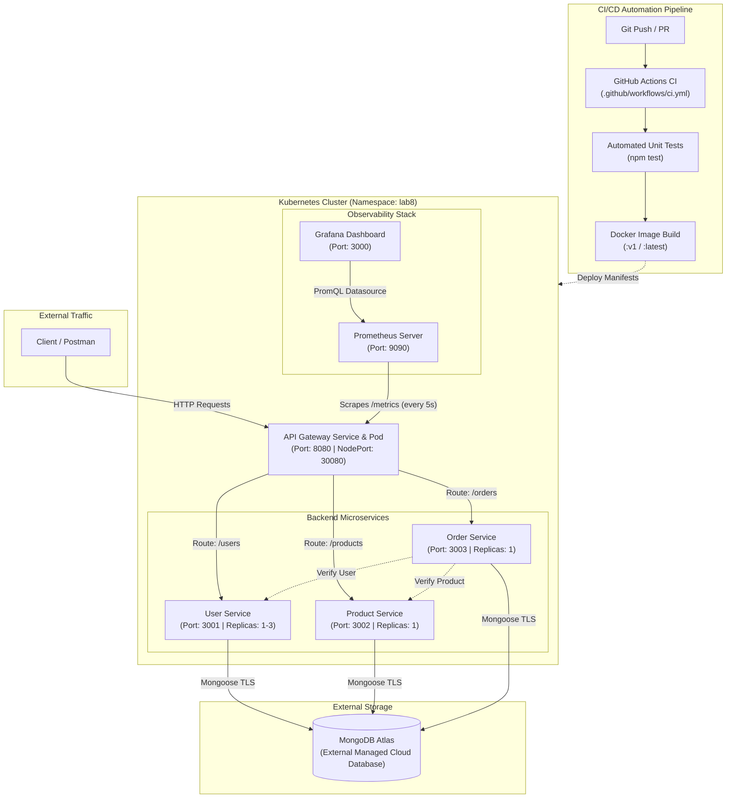

# Lab 8: Kubernetes Orchestration, Basic CI/CD & Monitoring with Prometheus & Grafana

**Web Services & SOA Laboratory • Lab 8**  
**Student Roll No:** 202512024  
**Project:** CampusConnect Microservices Platform  
**Environment:** Kubernetes (kind / Docker Desktop), GitHub Actions, Prometheus, Grafana, MongoDB Atlas  

---

## 1. Application Overview & Starting Point

This laboratory builds upon the **Lab 7 CampusConnect application**, transitioning the containerized microservices architecture into an automated, observable, and resilient Kubernetes-orchestrated system.

### Architecture Flow & Diagram:



### Components:
- **API Gateway (`api-gateway`)**: The unified public entry point acting as a reverse-proxy router, providing centralized request logging, error handling, health checking (`/health`), and Prometheus metrics scraping (`/metrics`).
- **User Service (`user-service`)**: Microservice managing student & faculty profiles on internal port `3001`.
- **Product Service (`product-service`)**: Microservice managing academic textbooks, supplies, and stationeries on internal port `3002`.
- **Order Service (`order-service`)**: Orchestrator coordinating order placement by validating customer records and item stock across services on internal port `3003`.
- **MongoDB Atlas / In-Cluster Database**: External managed persistent database storage.

---

## 2. Prerequisites & Selected Kubernetes Environment

- **Docker Desktop**: Version 29.8+ (container engine)
- **Kubernetes CLI (`kubectl`)**: Version v1.32+
- **Kubernetes Environment**: `kind` (Kubernetes in Docker) / Docker Desktop Kubernetes cluster
- **Node.js**: Version 20.x or higher
- **Postman**: HTTP API Client
- **Prometheus & Grafana**: Deployed as Kubernetes services in namespace `lab8`

---

## 3. Kubernetes Deployment & Service Discovery (Part A)

### 3.1 Cluster Access & Namespace Creation
To inspect the cluster and prepare the environment:
```powershell
# 1. Verify active context and node
kubectl config current-context
kubectl get nodes

# 2. Create and set namespace
kubectl create namespace lab8
kubectl config set-context --current --namespace=lab8
```

### 3.2 Manifest Directory Structure (`k8s/`)
All application manifests are organized in `k8s/`:
```text
k8s/
├── configmap.yaml            # Non-sensitive service URLs & ports
├── secret.yaml               # Database credentials & sensitive URIs
├── gateway-deployment.yaml   # API Gateway Deployment (port 8080)
├── gateway-service.yaml      # API Gateway NodePort/ClusterIP Service
├── user-deployment.yaml      # User Service Deployment (port 3001)
├── user-service.yaml         # User Service ClusterIP Service
├── product-deployment.yaml   # Product Service Deployment (port 3002)
├── product-service.yaml      # Product Service ClusterIP Service
├── order-deployment.yaml     # Order Service Deployment (port 3003)
├── order-service.yaml        # Order Service ClusterIP Service
└── mongo-deployment.yaml     # In-cluster MongoDB Deployment & Service
```

### 3.3 Configuration & Service Discovery
- Non-sensitive parameters are managed using `campusconnect-config` ConfigMap:
  - `USER_SERVICE_URL: http://user-service:3001`
  - `PRODUCT_SERVICE_URL: http://product-service:3002`
  - `ORDER_SERVICE_URL: http://order-service:3003`
- Database credentials and connection strings are managed via `campusconnect-secrets` Secret:
  - `MONGO_URI_USER`, `MONGO_URI_PRODUCT`, `MONGO_URI_ORDER`
- **Internal DNS Service Discovery**: Pods never address individual pod IPs. Internal communication resolves stable Kubernetes Service names (`user-service`, `product-service`, `order-service`).

### 3.4 Applying Manifests & Verifying Resources
```powershell
# Apply all manifests into lab8 namespace
kubectl apply -f k8s/ -n lab8

# Verify Deployments, Pods and Services
kubectl get deployments -n lab8
kubectl get pods -n lab8
kubectl get services -n lab8
```

### 3.5 Exposing & Testing the Gateway
The API Gateway is exposed externally via NodePort (port 30080) and port-forwarding:
```powershell
# Expose gateway locally on port 8080
kubectl port-forward svc/api-gateway 8080:8080 -n lab8
```
Test endpoints using Postman or curl:
- **Gateway Health**: `GET http://localhost:8080/health`
- **Prometheus Metrics**: `GET http://localhost:8080/metrics`
- **User Service Route**: `GET http://localhost:8080/users`
- **Product Service Route**: `GET http://localhost:8080/products`
- **Order Service Route**: `GET http://localhost:8080/orders`

---

## 4. Scaling & Self-Healing Demonstrations

### 4.1 Scaling User Service (1 to 3 Replicas)
```powershell
# Scale User Service deployment to 3 replicas
kubectl scale deployment user-service --replicas=3 -n lab8

# Verify all 3 pods are running
kubectl get pods -n lab8 -l app=user-service
```
Kubernetes automatically registers the new Pod IPs in the `user-service` Endpoint list, load balancing requests across the 3 replicas while the Service IP and DNS name remain unchanged.

### 4.2 Self-Healing Demonstration
```powershell
# 1. Identify a User Service pod
kubectl get pods -n lab8 -l app=user-service

# 2. Delete the pod
kubectl delete pod <user-service-pod-name> -n lab8

# 3. Observe Kubernetes controller recreating a replacement pod immediately
kubectl get pods -n lab8 -l app=user-service -w
```

### 4.3 Kubernetes Inspection & Troubleshooting
```powershell
# Inspect pod details and events
kubectl describe pod <pod-name> -n lab8

# Inspect container logs
kubectl logs <pod-name> -n lab8

# Verify service discovery endpoints
kubectl get endpoints -n lab8
```

---

## 5. Basic CI/CD with GitHub Actions (Part B)

The CI workflow is configured under `.github/workflows/ci.yml`.

### Workflow Stages:
1. **Trigger**: Runs automatically on every `push` and `pull_request` to `main` or `master`.
2. **Runner**: Hosted `ubuntu-latest` virtual environment.
3. **Checkout**: Checks out source code using `actions/checkout@v4`.
4. **Node Setup & Dependency Installation**: Caches and installs dependencies (`npm ci` / `npm install`) across all services (`api-gateway`, `user-service`, `product-service`, `order-service`).
5. **Automated Unit Testing**: Runs test suites (`npm test`) validating configuration, data models, and Joi schemas.
6. **Container Image Build**: Builds Docker images tagged with `${{ github.sha }}` and `latest`.

### GitHub Actions Verification:
1. Push changes to GitHub repository:
   ```bash
   git add .
   git commit -m "feat: Add Kubernetes manifests and GitHub Actions CI workflow"
   git push origin main
   ```
2. Navigate to **Actions** tab on GitHub and view the successful build and test job runs.

---

## 6. Monitoring with Prometheus & Grafana (Part C)

### 6.1 Application Instrumentation
The `api-gateway` is instrumented with `prom-client`:
- Tracks `http_requests_total{method, route, status}` counter.
- Tracks `http_request_duration_seconds{method, route, status}` histogram.
- Collects standard Node.js runtime metrics (`campusconnect_process_cpu_seconds_total`, memory usage).
- Exposes metrics at `GET /metrics`.

### 6.2 Prometheus Deployment & Configuration
Deployed using `k8s/monitoring/prometheus.yaml`:
```powershell
kubectl apply -f k8s/monitoring/prometheus.yaml -n lab8
```
- Scrapes `api-gateway:8080/metrics` every 5 seconds.
- Target reachability verified via query: `up`
- Request rate query: `rate(http_requests_total[5m])`

### 6.3 Grafana Dashboard
Deployed using `k8s/monitoring/grafana.yaml`:
```powershell
kubectl apply -f k8s/monitoring/grafana.yaml -n lab8
```
Access Grafana by port-forwarding:
```powershell
kubectl port-forward svc/grafana 3000:3000 -n lab8
```
Default Credentials: `admin` / `admin`.

The pre-provisioned **CampusConnect Lab 8 Monitoring Dashboard** contains 4 panels answering core operational questions:
| Panel Title | Query Expression | Operational Question Answered |
| :--- | :--- | :--- |
| **Availability (Stat)** | `up{job="api-gateway"}` | *Are targets reachable?* Displays green UP (1) or red DOWN (0). |
| **Traffic Rate (Time Series)** | `sum(rate(http_requests_total[1m])) by (route)` | *How much traffic is arriving?* Shows real-time req/sec per route. |
| **Error Rate (Bars/Series)** | `sum(rate(http_requests_total{status=~"4..\|5.."}[1m])) by (status, route)` | *Are failures increasing?* Highlights 4xx and 5xx error spikes. |
| **Average Latency (Time Series)**| `sum(rate(http_request_duration_seconds_sum[1m])) / sum(rate(http_request_duration_seconds_count[1m]))` | *How long are requests taking?* Measures response latency in seconds. |

### 6.4 API Traffic Generation
Run the automated traffic generator:
```powershell
node generate_traffic.js localhost 8080 50 150
```
This sends a blend of normal requests (`/users`, `/products`, `/orders`, `/health`) and controlled error requests (`/nonexistent`, invalid payload) to observe changes on the Grafana dashboard in real time.

---

## 7. Submission Evidence & Deliverables Checklist

See [TEST_EVIDENCE.md](file:///d:/DAIICT/Sem-3/WSSOA/Lab/Lab8/202512024_Lab8_Kubernetes_CICD_Monitoring/TEST_EVIDENCE.md) for the complete visual report with all screenshots embedded.

| No. | Evidence Item (Manual §7.1) | Required Content | Captured Screenshot Location |
| :---: | :--- | :--- | :--- |
| **1** | **Lab 7 Baseline** | Successful gateway request & response | `Screenshots/5_Get_health.png`<br/>`Screenshots/4_Test_the_APIGateway.png` |
| **2** | **Kubernetes Environment** | Current context + available node(s) | `Screenshots/1_Verify_Kubernetes_Cluster.png` |
| **3** | **Manifests** | Gateway, service and config YAML files | `Screenshots/2_YAML_manifests.png` |
| **4** | **Deployment** | Pods, Deployments and Services in `lab8` | `Screenshots/3_All_Pods_Running_State.png` |
| **5** | **Gateway Test** | Successful Postman request through K8s gateway | `Screenshots/6_Get_users.png`<br/>`Screenshots/7_Get_products.png`<br/>`Screenshots/8_Get_orders.png` |
| **6** | **Scaling** | User Service scaled to 3 replicas | `Screenshots/10_Kubernetes_Scaling.png` |
| **7** | **Self-Healing** | Deleted Pod followed by new replacement | `Screenshots/12_Kubernetes_SelfHealing.png` |
| **8** | **Troubleshooting** | Useful describe, logs, endpoints output | `Screenshots/11_Kubernetes_Inspection_Troubleshooting.png` |
| **9** | **GitHub Actions** | Successful basic CI workflow run | `Screenshots/9_GitHub_Actions_CI_Run.png` |
| **10** | **Prometheus** | Targets/UP state and at least one query | `Screenshots/17_Prometheus_targets_page.png`<br/>`Screenshots/13_Prometheus_query_output.png` |
| **11** | **Grafana** | Monitoring dashboard with 4 panels | `Screenshots/14_Grafana_dashboard.png` |
| **12** | **Traffic** | Monitoring after API traffic generation | `Screenshots/15_Grafana_dashboard_metrics.png` |
| **13** | **Architecture** | Final architecture diagram | `Screenshots/16_Architecture_Diagram.png` |

---

## 8. Final Submission Checklist

- [x] Lab 7 application verified.
- [x] Kubernetes context and nodes verified.
- [x] `lab8` namespace created and used.
- [x] Gateway/User/Product/Order Deployments and Services created.
- [x] ConfigMap and Secret used appropriately without exposed credentials.
- [x] Application manifests applied and verified.
- [x] Gateway tested via Postman / HTTP client.
- [x] User Service scaled to 3 replicas.
- [x] Self-healing demonstrated by pod deletion and recreation.
- [x] Basic GitHub Actions CI workflow created (`.github/workflows/ci.yml`).
- [x] Prometheus targets and metrics verified (`/metrics`, `up`, `rate(http_requests_total)`).
- [x] Grafana dashboard created and pre-configured.
- [x] API traffic generated and observed on monitoring graphs.
- [x] Complete README and Postman collection updated.
