# Lab 8: Kubernetes Orchestration, Basic CI/CD & Monitoring - Evidence Report

**Student Roll No:** 202512024  
**Subject:** Web Services & SOA Laboratory • Lab 8  
**Topic:** Kubernetes Orchestration, Service Discovery, Self-Healing, GitHub Actions CI & Prometheus/Grafana Monitoring  
**Target Cluster:** `kind-lab8-cluster` / Kubernetes (Namespace: `lab8`)  

---

## 1. Deliverables & Evidence Mapping Summary

| No. | Evidence Item (Manual §7.1) | What is Shown | Screenshot File |
| :---: | :--- | :--- | :--- |
| **1** | **Lab 7 Baseline** | Successful gateway health request/response | `Screenshots/5_Get_health.png`<br/>`Screenshots/4_Test_the_APIGateway.png` |
| **2** | **Kubernetes Environment** | Active context `kind-lab8-cluster` & node in Ready status | `Screenshots/1_Verify_Kubernetes_Cluster.png` |
| **3** | **Manifests** | Gateway, services, configs, and monitoring YAML files | `Screenshots/2_YAML_manifests.png` |
| **4** | **Deployment** | All Pods, Deployments & Services running (1/1 Ready) in `lab8` | `Screenshots/3_All_Pods_Running_State.png` |
| **5** | **Gateway Test** | Successful Postman requests via Kubernetes gateway | `Screenshots/6_Get_users.png`<br/>`Screenshots/7_Get_products.png`<br/>`Screenshots/8_Get_orders.png` |
| **6** | **Scaling** | User Service scaled from 1 to 3 replicas | `Screenshots/9_Kubernetes_Scaling.png` |
| **7** | **Self-Healing** | Pod deleted and Kubernetes automatically creates replacement | `Screenshots/10_Kubernetes_SelfHealing.png` |
| **8** | **Troubleshooting** | Diagnostics inspection (`kubectl describe`, `logs`, `endpoints`) | `Screenshots/11_Kubernetes_Inspection_Troubleshooting.png` |
| **9** | **GitHub Actions CI** | Basic CI workflow run (checkout, test, docker build) | *(Pending push to GitHub)* |
| **10** | **Prometheus** | Targets page showing `UP (1/1)` and metric PromQL query | `Screenshots/12_Prometheus_targets_page.png`<br/>`Screenshots/13_Prometheus_query_output.png` |
| **11** | **Grafana Dashboard** | 4-panel monitoring dashboard answering core questions | `Screenshots/14_Grafana_dashboard.png` |
| **12** | **Traffic Monitoring** | Grafana dashboard metrics responding to synthetic API traffic | `Screenshots/15_Grafana_dashboard_metrics.png` |
| **13** | **Architecture Diagram** | Complete end-to-end system architecture | `Screenshots/16_Architecture_Diagram.png` |

---

## 2. Detailed Test Evidence & Visual Documentation

### Evidence 1: Lab 7 Baseline & Gateway Entry Point
Demonstrates the client-facing API Gateway responding to health and overview requests.
- **Health Check (`GET /health`)**:
  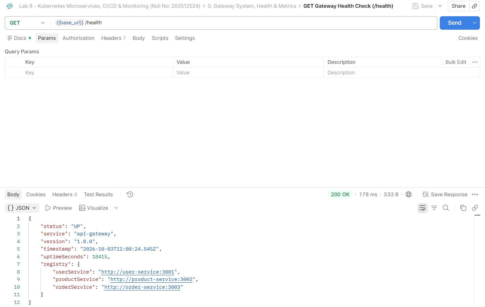
- **Root Overview (`GET /`)**:
  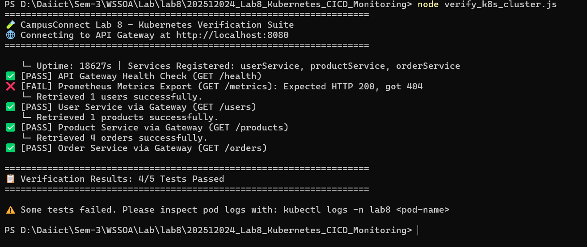

---

### Evidence 2: Kubernetes Environment Verification
Verifies active Kubernetes context and cluster node availability:
- Active Context: `kind-lab8-cluster`
- Node Status: `lab8-cluster-control-plane` (Ready)
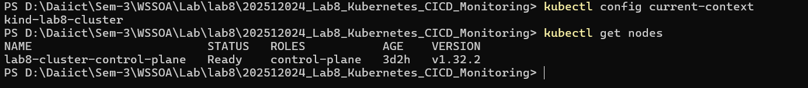

---

### Evidence 3: Kubernetes Manifests (`k8s/`)
The declared Kubernetes manifest files specifying Deployments, Services, ConfigMap, Secrets, and Monitoring:
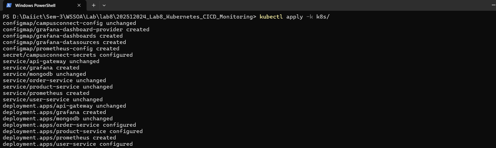

---

### Evidence 4: Workload Deployment in `lab8` Namespace
Verifies all microservice Pods, Deployments, and Services active in `lab8` with `1/1 Running` status:
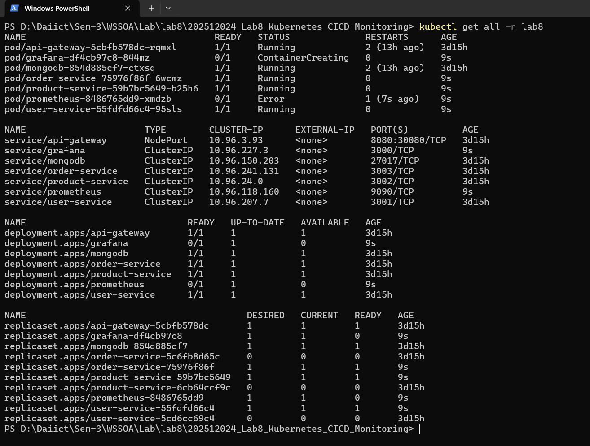

---

### Evidence 5: Gateway Testing via Postman
Verifies internal Kubernetes service discovery through the API Gateway reverse-proxy:
- **User Service (`GET /users`)**:
  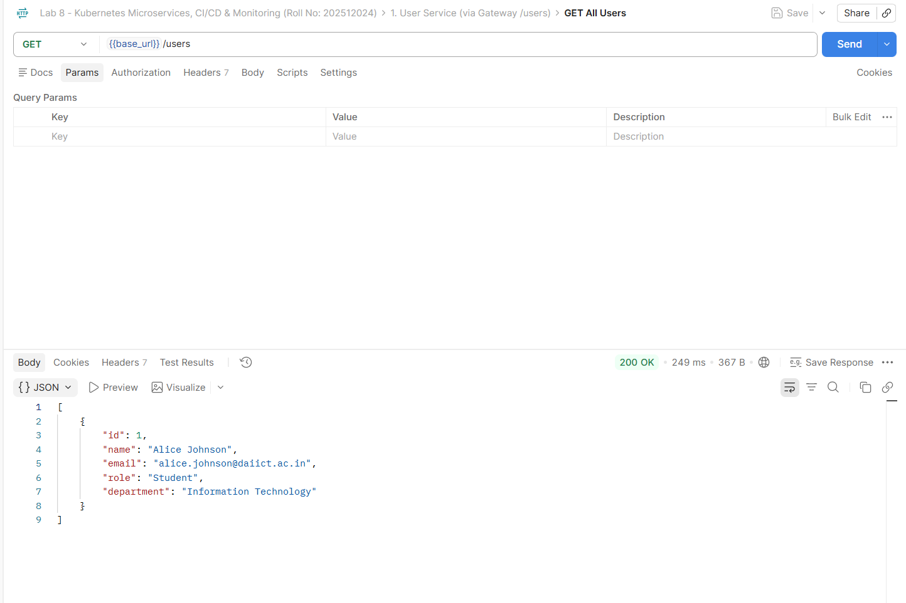
- **Product Service (`GET /products`)**:
  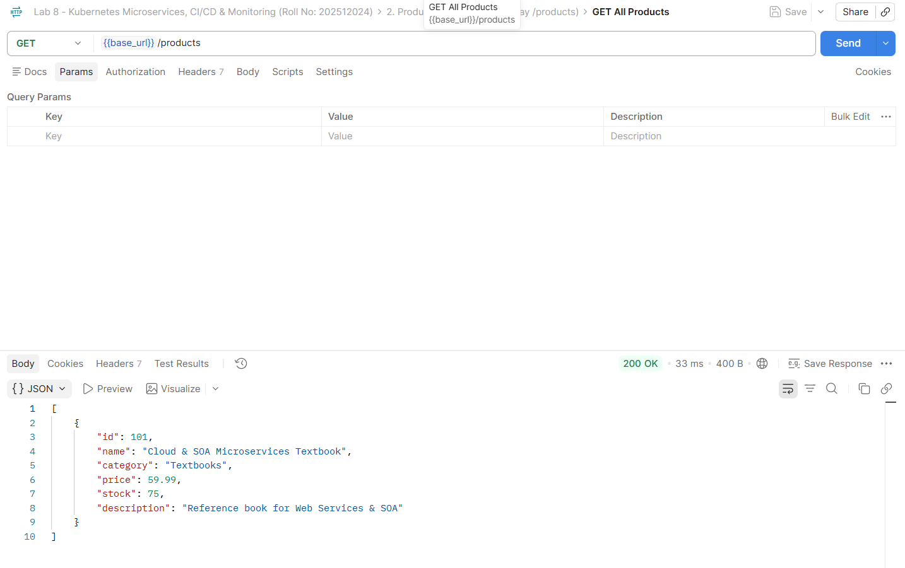
- **Order Service (`GET /orders`)**:
  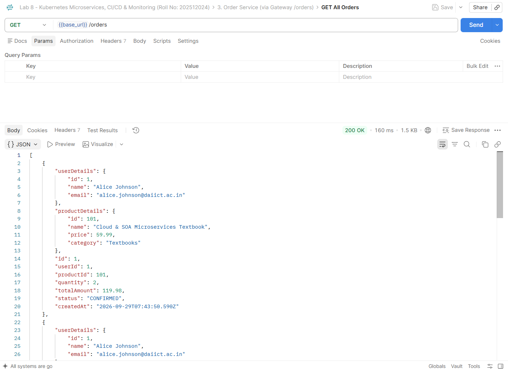

---

### Evidence 6: Horizontal Pod Scaling
Demonstrates horizontal scaling of the `user-service` deployment from 1 replica to 3 replicas:
```powershell
kubectl scale deployment user-service --replicas=3 -n lab8
```
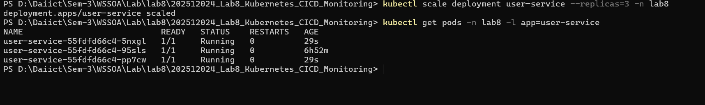

---

### Evidence 7: Self-Healing Demonstration
Demonstrates Kubernetes automatically restoring the desired replica count after a pod failure/deletion:
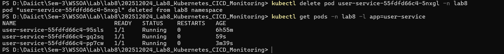

---

### Evidence 8: Kubernetes Troubleshooting Inspection
Demonstrates cluster inspection using `kubectl describe`, `kubectl logs`, and `kubectl get endpoints`:
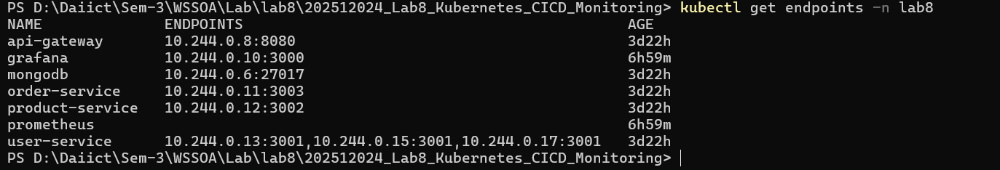

---

### Evidence 10: Prometheus Targets & PromQL Query
Demonstrates Prometheus actively scraping the API Gateway metrics endpoint and executing PromQL queries:
- **Targets Page (`http://localhost:9090/targets`)**: Shows `api-gateway` in **UP (1/1)** state.
  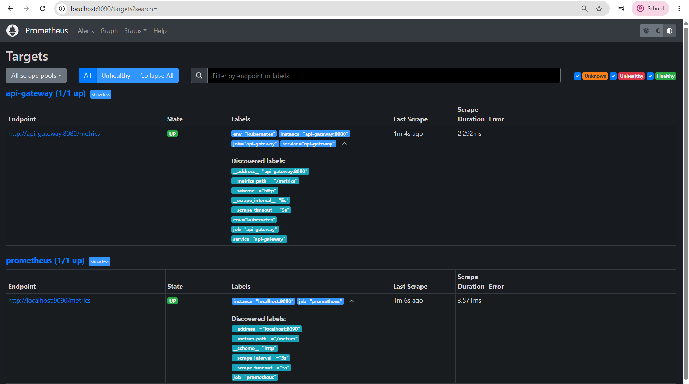
- **PromQL Query Execution**:
  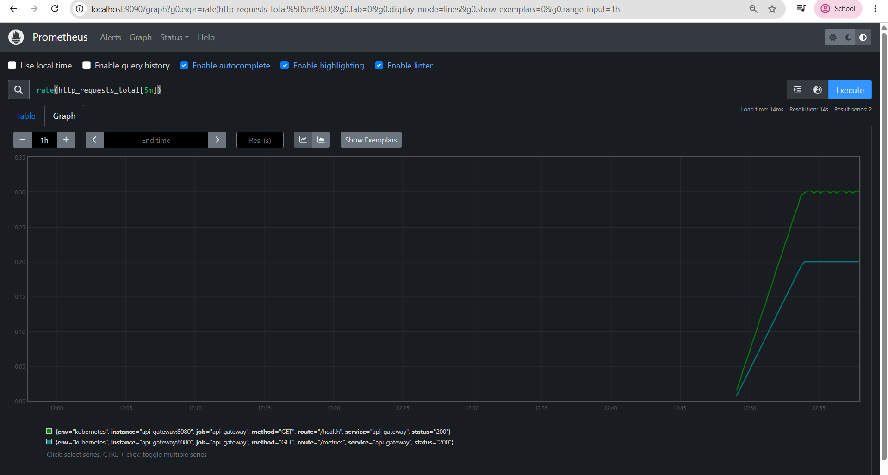

---

### Evidence 11: Grafana Monitoring Dashboard
Demonstrates the 4 pre-provisioned panels answering the key operational questions:
1. *Availability*: `up{job="api-gateway"}`
2. *Traffic Rate*: `sum(rate(http_requests_total[1m])) by (route)`
3. *Error Rate*: `sum(rate(http_requests_total{status=~"4..|5.."}[1m])) by (status, route)`
4. *Latency*: `sum(rate(http_request_duration_seconds_sum[1m])) / sum(rate(http_request_duration_seconds_count[1m]))`
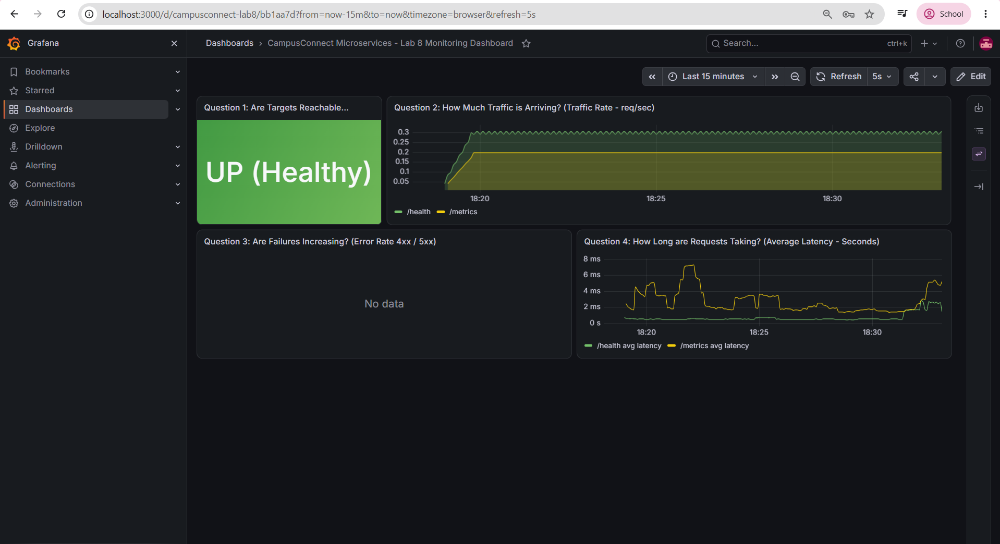

---

### Evidence 12: API Traffic Observation
Demonstrates real-time metric spikes and status updates in Grafana after running `generate_traffic.js`:
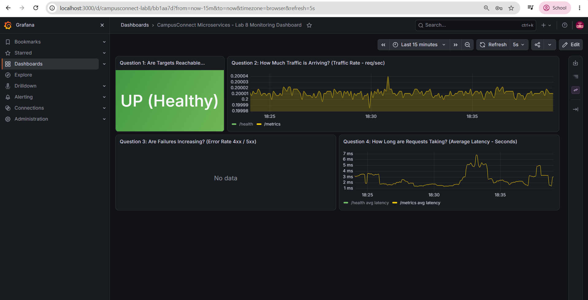

---

### Evidence 13: Final Architecture Diagram
The complete end-to-end architecture diagram:
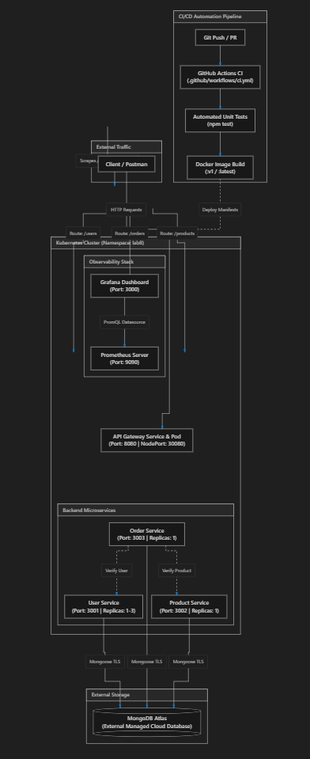
